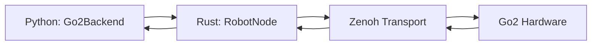

# Go2 Quickstart

If you have a Unitree Go2 quadruped, this is the fastest path.

## Prerequisites

- rfx installed from source (`bash scripts/setup-from-source.sh`)
- Go2 powered on and connected via Ethernet (default IP: `192.168.123.161`)
- Rust extension built (`maturin develop`)

## 1) Check environment

```bash
rfx doctor
```

Verify that the Rust extension (`rfx._rfx`) loads and your network can reach the Go2.

## 2) Connect and observe

```python
import rfx

robot = rfx.RealRobot(rfx.GO2_CONFIG)
obs = robot.observe()
print(obs["state"].shape)  # torch.Size([1, 64])
robot.disconnect()
```

## 3) High-level commands

The Go2 backend exposes locomotion commands on top of the standard `observe`/`act`/`reset` interface:

```python
from rfx.real import RealRobot
from rfx.robot.config import GO2_CONFIG

robot = RealRobot(GO2_CONFIG)

robot._backend.stand()                    # recovery stand
robot._backend.sit()                      # sit down
robot._backend.walk(vx=0.3, vy=0.0, vyaw=0.0)  # walk forward
robot._backend.stand()                    # stop and stand
robot.disconnect()
```

## 4) Deploy a policy

```bash
rfx deploy runs/go2-walk-v1 --robot go2
rfx deploy hf://rfx-community/go2-walk-v1 --robot go2 --duration 30
```

Or from Python:

```python
rfx.deploy("runs/go2-walk-v1", robot="go2", duration=30)
```

## Architecture



The default backend uses the Rust `RobotNode` pipeline with Zenoh transport. This gives you real-time pub/sub between your Python policy and the robot.

Legacy backends (`unitree_sdk2py`, subprocess) are kept for backwards compatibility but are not recommended. Force the Rust backend with:

```bash
export RFX_GO2_BACKEND=rust
```

## Configuration

Default config (`rfx/configs/go2.yaml`):

```yaml
name: Unitree Go2
state_dim: 34      # 12 pos + 12 vel + 4 quat + 3 gyro + 3 acc
action_dim: 12     # 12 joint position commands
control_freq_hz: 200

joints:
  - {name: FR_hip, index: 0}
  - {name: FR_thigh, index: 1}
  - {name: FR_calf, index: 2}
  - {name: FL_hip, index: 3}
  - {name: FL_thigh, index: 4}
  - {name: FL_calf, index: 5}
  - {name: RR_hip, index: 6}
  - {name: RR_thigh, index: 7}
  - {name: RR_calf, index: 8}
  - {name: RL_hip, index: 9}
  - {name: RL_thigh, index: 10}
  - {name: RL_calf, index: 11}

hardware:
  ip_address: 192.168.123.161
  edu_mode: false
```

Override at runtime:

```python
robot = rfx.RealRobot(rfx.GO2_CONFIG, ip_address="10.0.0.50")
```

## Simulation

Run the Go2 in Genesis without hardware:

```bash
uv run --python 3.13 rfx/examples/universal_go2.py --backend genesis --auto-install
```

Place URDF assets under `rfx/assets/robots/go2/urdf/` first. See [Simulation Guide](sim.md) for details.

## State vector layout

| Index | Field |
|-------|-------|
| 0-11 | Joint positions (FR hip/thigh/calf, FL, RR, RL) |
| 12-23 | Joint velocities |
| 24-27 | Body quaternion (w, x, y, z) |
| 28-30 | Gyroscope (rad/s) |
| 31-33 | Accelerometer |

## Troubleshooting

- **Can't reach robot**: Verify Ethernet connection and `ping 192.168.123.161`.
- **Rust extension missing**: Run `maturin develop` from repo root.
- **Legacy backend warning**: Set `RFX_GO2_BACKEND=rust` or pass `hw_backend="rust"`.
- **Edu mode**: Pass `edu_mode=True` if your Go2 is in education mode (disables sport client).
