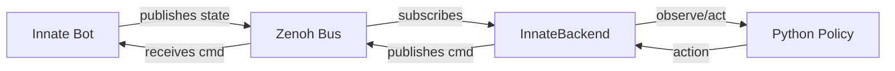

# Innate Bot

The Innate backend connects to bots that publish their own state over Zenoh. Unlike the Go2 or SO-101 backends, no Rust `RobotNode` is needed — the bot itself is the Zenoh publisher.

## Prerequisites

- rfx installed (`uv pip install rfx-sdk` or from source)
- `eclipse-zenoh` Python package: `pip install eclipse-zenoh`
- Innate bot powered on and reachable over the network

## Quick start

```python
from rfx.real import InnateRobot

robot = InnateRobot()
obs = robot.observe()
robot.act(action_tensor)
robot.disconnect()
```

With a custom Zenoh endpoint (multi-machine setup):

```python
robot = InnateRobot(zenoh_endpoint="tcp/10.0.0.1:7447")
```

## Architecture



The bot publishes joint state to a Zenoh topic. `InnateBackend` subscribes, deserializes, and exposes it through the standard `observe()`/`act()`/`reset()` interface. Commands flow back the same way.

## Configuration

Default config (`INNATE_CONFIG`):

```python
from rfx.robot.config import INNATE_CONFIG

print(INNATE_CONFIG.action_dim)       # 6
print(INNATE_CONFIG.control_freq_hz)  # 50
```

Hardware settings are passed through to the backend:

| Setting | Default | Description |
|---------|---------|-------------|
| `zenoh_state_topic` | `innate/joint_states` | Zenoh key for state subscription |
| `zenoh_cmd_topic` | `innate/joint_commands` | Zenoh key for command publishing |
| `msg_format` | `json` | Message format: `json` or `cdr` |
| `zenoh_endpoint` | none | Optional Zenoh router address |

Override via hardware config dict or kwargs:

```python
from rfx.real import RealRobot
from rfx.robot.config import INNATE_CONFIG

robot = RealRobot(
    INNATE_CONFIG,
    zenoh_state_topic="my_bot/joints",
    zenoh_cmd_topic="my_bot/commands",
    msg_format="cdr",
    zenoh_endpoint="tcp/10.0.0.1:7447",
)
```

## Message formats

### JSON (default)

State messages accepted in two formats:

rfx-native:
```json
{
  "joint_positions": [0.1, 0.2, 0.3, 0.4, 0.5, 0.6],
  "joint_velocities": [0.0, 0.0, 0.0, 0.0, 0.0, 0.0]
}
```

JointState-like:
```json
{
  "position": [0.1, 0.2, 0.3, 0.4, 0.5, 0.6],
  "velocity": [0.0, 0.0, 0.0, 0.0, 0.0, 0.0]
}
```

Command messages:
```json
{"position": [0.1, 0.2, 0.3, 0.4, 0.5, 0.6]}
```

### CDR (ROS 2 compatible)

Set `msg_format: "cdr"` to receive `sensor_msgs/msg/JointState` messages encoded in CDR (Common Data Representation). The backend includes a minimal CDR deserializer that extracts position, velocity, and effort arrays.

Commands in CDR mode are sent as raw little-endian `float64` arrays (not full CDR JointState).

## Deploy a policy

```bash
rfx deploy runs/my-policy --robot innate
```

```python
rfx.deploy("runs/my-policy", robot="innate")
```

## Custom joint count

If your bot has more or fewer than 6 joints, create a custom config:

```python
from rfx.robot.config import RobotConfig, JointConfig

my_config = RobotConfig(
    name="Innate",
    state_dim=16,   # 8 pos + 8 vel
    action_dim=8,
    joints=[JointConfig(name=f"joint_{i}", index=i) for i in range(8)],
    hardware={
        "zenoh_state_topic": "my_bot/joints",
        "zenoh_cmd_topic": "my_bot/commands",
        "msg_format": "json",
    },
)

robot = RealRobot(my_config, robot_type="innate")
```

## Troubleshooting

- **`ImportError: zenoh`**: Install with `pip install eclipse-zenoh`.
- **No state received**: Verify the bot is publishing to the expected topic. Check with `zenoh` CLI tools or set `logging.basicConfig(level=logging.DEBUG)`.
- **CDR parse errors**: Ensure the bot sends standard ROS 2 CDR-encoded `sensor_msgs/JointState`. The deserializer expects little-endian encoding with a 4-byte CDR encapsulation header.
- **Multi-machine**: Pass `zenoh_endpoint="tcp/<router_ip>:7447"` to connect through a Zenoh router.
