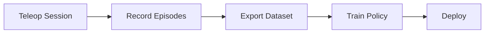
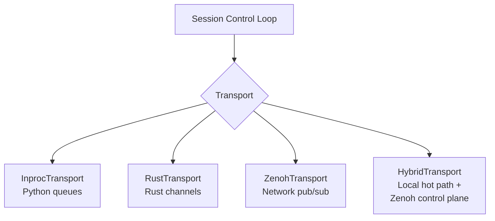

# Teleoperation

Teleoperation is how you collect demonstrations for policy training. rfx provides a high-level `run()` function and a lower-level `BimanualSo101Session` for full control.

## The workflow



Leader arms drive follower arms. Joint positions are recorded at up to 350 Hz. Episodes are saved locally and can be exported to LeRobot or MCAP format for training.

## Quick start

```python
from rfx.teleop import run, so101

arm = so101(
    leader_port="/dev/cu.usbmodemA",
    follower_port="/dev/cu.usbmodemB",
)
run(arm)
```

That's it — teleop starts, Ctrl+C to stop.

## Recording demos

Pass `data_output` to enable recording:

```python
from rfx.teleop import run, so101

arm = so101()
run(
    arm,
    data_output="demos",
    duration_s=30.0,
    rate_hz=200,
)
```

### Export formats

Export during recording by setting `format`:

```python
# Native (JSONL + NumPy)
run(arm, data_output="demos", format="native")

# LeRobot dataset
run(arm, data_output="demos", format="lerobot", lineage="my-org/so101-demos")

# MCAP timeline
run(arm, data_output="demos", format="mcap")
```

Or use the CLI:

```bash
rfx record --robot so101 --repo-id my-org/demos --episodes 10
```

## Bimanual setup

For two-arm teleoperation, pass multiple arm pairs:

```python
from rfx.teleop import run
from rfx.teleop.config import ArmPairConfig

left = ArmPairConfig(
    leader_port="/dev/cu.usbmodemA",
    follower_port="/dev/cu.usbmodemB",
    name="left",
)
right = ArmPairConfig(
    leader_port="/dev/cu.usbmodemC",
    follower_port="/dev/cu.usbmodemD",
    name="right",
)
run([left, right], data_output="bimanual_demos")
```

Or use the config-driven approach:

```bash
cli/rfx.sh so101-bimanual
```

Default bimanual config: `rfx/configs/so101_bimanual.yaml`

## Camera integration

Add camera streams to your session:

```python
from rfx.teleop import run, so101
from rfx.teleop.config import CameraStreamConfig

arm = so101()
run(
    arm,
    cameras=[
        CameraStreamConfig(name="wrist", device_id=0, width=640, height=480, fps=30),
    ],
    data_output="demos_with_video",
)
```

Camera frames are captured in a background thread and synchronized with joint data.

## Transport layer

Teleop uses a pluggable transport for pub/sub messaging between components:



| Transport | Use case |
|-----------|----------|
| `InprocTransport` | Single-process, no native deps |
| `RustTransport` | Single-process, low-latency via Rust channels |
| `ZenohTransport` | Multi-machine, network-transparent |
| `HybridTransport` | Local hot path + Zenoh for remote monitoring |

The default is auto-selected based on available backends. Override with the `transport` parameter.

## Session API (advanced)

For full control, use `BimanualSo101Session` directly:

```python
from rfx.teleop.session import BimanualSo101Session
from rfx.teleop.config import TeleopSessionConfig, ArmPairConfig

config = TeleopSessionConfig(
    arm_pairs=(ArmPairConfig(leader_port="auto", follower_port="auto"),),
    rate_hz=200,
)

with BimanualSo101Session(config=config) as session:
    session.start_recording(label="episode-1")
    # ... session runs in background thread
    episode = session.stop_recording()
    print(episode)
```

Key methods:

| Method | Description |
|--------|-------------|
| `start()` / `stop()` | Start/stop the control loop |
| `start_recording()` / `stop_recording()` | Begin/end episode recording |
| `record_episode(duration_s=...)` | Record a fixed-length episode |
| `go_home()` | Send all arms to home position |
| `timing_stats()` | Get loop timing statistics |
| `check_health()` | Verify session health (raises on error) |

## OpenTelemetry

Enable tracing for debugging timing issues:

```bash
export RFX_OTEL=1
export RFX_OTEL_EXPORTER=console
export RFX_OTEL_SAMPLE_EVERY=100
```

```python
run(arm, otel=True, otel_exporter="console")
```

## `run()` reference

```python
run(
    arm,                          # ArmPairConfig or list of them
    logging=False,                # live movement trace in terminal
    rate_hz=None,                 # control loop frequency (default: from config)
    duration_s=None,              # run duration (None = until Ctrl+C)
    cameras=None,                 # list of CameraStreamConfig
    transport=None,               # override transport backend
    data_output=None,             # directory to save recordings
    lineage=None,                 # dataset lineage tag
    scale=None,                   # run scale metadata
    format="native",              # export format: native, lerobot, mcap
    metadata=None,                # extra metadata dict
    otel=False,                   # enable OpenTelemetry
    otel_exporter="console",      # OTEL exporter: console or otlp
    otel_sample_every=100,        # trace every N iterations
    otlp_endpoint=None,           # OTLP collector endpoint
)
```
